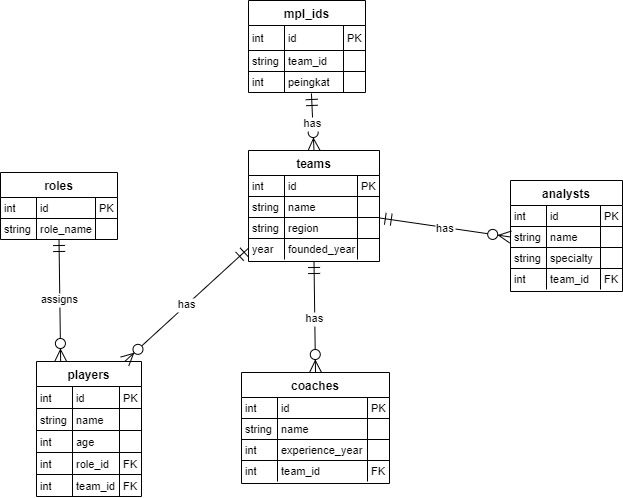

# Tugas Praktikum 7 DPBO 2025 C1  
Raffi Adzril Alfaiz - Ilmu Komputer UPI  
---

## Janji Mahasiswa
Saya, **Raffi Adzril Alfaiz** dengan **NIM 2308355**, mengerjakan Tugas Praktikum 7 dalam mata kuliah **Desain dan Pemrograman Berorientasi Objek** untuk keberkahan-Nya. Maka saya **tidak melakukan kecurangan** seperti yang telah dispesifikasikan. Aamiin.  
---

# Website OOP MPL ID (Mobile Legends Professional League)

## Deskripsi Singkat
Website ini adalah implementasi konsep **Object-Oriented Programming (OOP)** menggunakan bahasa pemrograman **PHP**, dengan dukungan **database MySQL** untuk pengelolaan data. Aplikasi ini menampilkan data dari MPL ID seperti tim, pemain, pelatih, pertandingan, dan peringkat tim, serta menerapkan fitur **CRUD (Create, Read, Update, Delete)** dan **search/filter**.

---

## Fitur Utama
- CRUD untuk setiap entitas:
  - Teams
  - Players
  - Coaches
  - Analysts
  - Role
  - MPL ID Ranking
- Pencarian (search) berdasarkan nama pada setiap entitas
- Modularisasi kode: pemisahan antara model, view, dan konfigurasi database
- Desain responsif dan rapi menggunakan CSS sederhana
- Keamanan query menggunakan **Prepared Statements** (PDO)

---

## Desain Program
Program mengikuti struktur OOP di mana setiap entitas memiliki class masing-masing (tidak ada parent jadi tidak membuat UML diagram cukup ERD saja). Berikut adalah **Entity Relationship Diagram (ERD)** yang digunakan:

Terdapat 6 entitas utama:
1. Teams
2. Players
3. Coaches
4. Analysts
5. Matches
6. MPL ID (Peringkat)

Relasi antar entitas seperti:
- Players dan Coaches merujuk ke satu `Team`
- Analysts dengan Team
- Player dengan role
- MPL ID menyimpan peringkat tim berdasarkan `team_id`

---

## Alur Program

1. **`index.php`**: Menjadi entry point utama. Akan meng-handle routing berdasarkan `$_GET['page']` ke setiap view.
2. **View (`views/*.php`)**: Tampilkan data dari model, termasuk form tambah/edit dan tabel data.
3. **Model (`models/*.php`)**: Melakukan query ke database dengan metode OOP dan PDO.
4. **Database**: Disiapkan menggunakan SQL sesuai skema ERD.
5. **CRUD & Search**:
   - Tambah/Edit data menggunakan form HTML.
   - Data dikirim ke file `index.php` untuk diproses melalui model terkait.
   - Pencarian dapat dilakukan melalui parameter GET (`?search=`).

---

## Dokumentasi
Video dokumentasi penggunaan aplikasi:  
[`Recording Test Website OOP Database.mp4`](Recording%20Test%20Website%20OOP%20Database.mp4)

---

## Teknologi yang Digunakan
- PHP 8+
- MySQL
- HTML + CSS
- PDO (PHP Data Objects)
- XAMPP / Apache sebagai web server lokal

---

---

## Author
- Nama: **Raffi Adzril Alfaiz**
- NIM: **2308355**
- Kelas: **C1 - Ilmu Komputer**
- Universitas Pendidikan Indonesia

---
